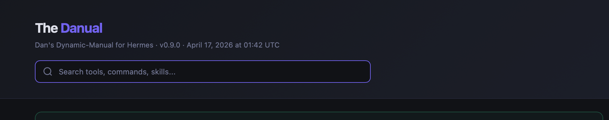
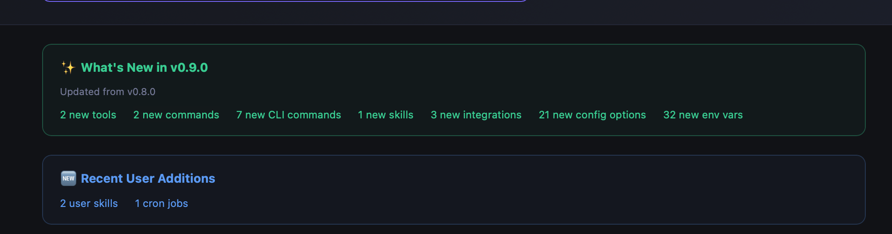
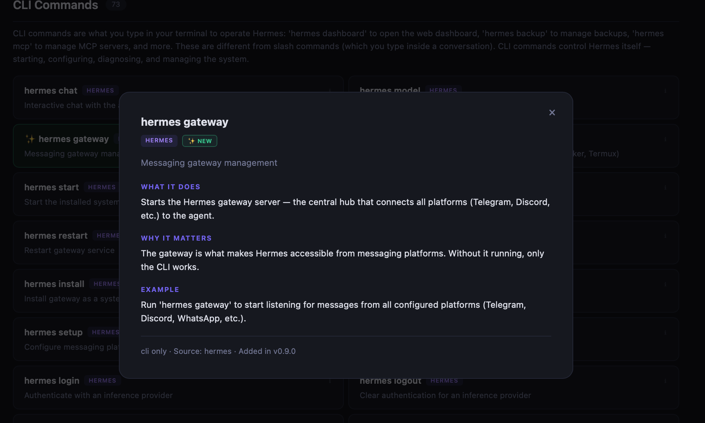

# The Danual 📘

> **Dan's Dynamic-Manual for Hermes** — an auto-updating HTML manual that flags exactly what changed in every Hermes update, so you always know what's new.



---

## What makes this different

Most documentation is a snapshot: someone writes it, you read it, it goes stale. **The Danual is dynamic.** It regenerates itself after every Hermes update, and again every night — scanning the actual state of your install and flagging anything that appeared since the last run:

- ✨ **NEW in vX.X** (green) — arrived with the most recent Hermes update. You can see what a release changed in a single glance instead of hunting through patch notes.
- 🆕 **Recently Added** (blue) — items *you* added locally between updates (your custom skills, new MCP servers, new cron jobs). Persists 30 days, configurable.

When Hermes bumps from v0.9.0 to v0.10.0, you don't read a changelog — you open the manual, see everything new highlighted in green, and click any of it to find out what it does. The green flags clear themselves on the next version; the blue flags expire on their own. Nothing to maintain, nothing to remember.



## What it covers

[Hermes](https://github.com/dealsinengines/hermes-agent) is a personal AI-agent platform with dozens of tools, hundreds of config options, and a whole ecosystem of skills. The Danual catalogs all of it in one searchable HTML file with plain-English explainers:

47 tools · 51 slash commands · 73 CLI subcommands · 90 skills · 19 platform integrations · 170 config options · 299 env vars · MCP servers · cron jobs · full release history.

No server, no external assets, no network calls — one self-contained HTML file you open in your browser.

---

## Features

- **Full coverage** — every tool, command, skill, integration, and config option in one place
- **Real-time search** — filter across all sections as you type
- **Click any item** for a plain-English explainer: what it does, why it matters, an example
- **Self-contained HTML** — ~1.1 MB, no CDN, no JS framework, works offline
- **Auto-rebuilds** via gateway startup hook + nightly cron — you never have to remember to regenerate
- **Release history** with clickable modals for every Hermes version
- **Dual badge system** — version-diff flags AND local-additions flags
- **Cascade detection** — a new platform auto-flags its env vars and config options
- **Configurable** — override the 30-day window in `~/.hermes/config.yaml`



---

## Install (for Hermes users)

### Requirements

- An existing [Hermes](https://github.com/dealsinengines/hermes-agent) install at `~/.hermes/`
- Python 3.11 in the Hermes venv (standard with Hermes)
- macOS or Linux (Windows untested)

### Steps

```bash
cd ~/.hermes/skills/devops/
git clone https://github.com/danrudy33/Danual.git danual
bash danual/scripts/install.sh
open ~/.hermes/docs/Danual.html
```

`install.sh` is idempotent and does three things:
1. Symlinks the gateway startup hook into `~/.hermes/hooks/` (so the manual auto-rebuilds after every `hermes update`).
2. Symlinks the nightly-cron helper script into `~/.hermes/scripts/`.
3. Runs the first full build.

After install, the manual lives at `~/.hermes/docs/Hermes_Manual.html` (and as a `Danual.html` symlink next to it). Because the hook and cron helper are *symlinks* back to the repo, `git pull` in the repo directory is enough to pick up future updates — nothing to reinstall.

### Optional: nightly cron

The gateway hook catches every `hermes update`, but if you want to also catch user-added skills / MCP servers / cron jobs that appear *between* Hermes updates, register the nightly rebuild via Hermes's cron system:

```bash
hermes cron create \
    --name 'Danual Nightly Rebuild' \
    --script danual_nightly.py \
    --schedule '0 4 * * *' \
    --deliver '<your-telegram-or-discord-target>'
```

(Replace the `--deliver` target with wherever you want the nightly summary sent.)

### Optional: one-word shortcut

Run the alias installer to add `danual` as a shell command:

```bash
bash ~/.hermes/skills/devops/danual/scripts/install-alias.sh
```

It detects your shell, shows the exact line it would add, and asks before modifying `~/.zshrc` or `~/.bashrc`. After installing, typing `danual` anywhere opens the manual in your browser.

### Optional: custom recently-added window

Add to `~/.hermes/config.yaml`:

```yaml
danual:
  recently_added_days: 7   # default is 30; any positive integer works
```

---

## How it auto-rebuilds

Two triggers handle this for you:

1. **Gateway startup hook** (`hooks/danual-rebuild/`) — fires after any gateway restart, including every `hermes update`. Full rebuild on version change, quick rebuild otherwise.
2. **Nightly cron** at 4 AM ET (`cron/danual_nightly.py`) — catches user additions between updates: new skills you drop into `~/.hermes/skills/`, new MCP servers, new cron jobs.

So you're never more than ~24 hours out of date, without thinking about it.

---

## Usage

Most of the time you don't need to run anything manually. But if you want to:

```bash
# Full pipeline — scan → diff → enrich → render
~/.hermes/skills/devops/danual/scripts/update_manual.sh

# Quick rebuild — skip LLM-style enrichment, reuse cached explainers
~/.hermes/skills/devops/danual/scripts/update_manual.sh --no-enrich

# Scan only — produce manifest.json without rebuilding HTML
~/.hermes/skills/devops/danual/scripts/update_manual.sh --scan-only
```

The script uses a lockfile so concurrent rebuilds (e.g. gateway hook + nightly cron firing at once) don't stomp each other.

---

## Architecture

```
update_manual.sh (wrapper)
    │
    ├── regenerate_manual.py  ← Scanner:   reads Hermes registries → manifest.json
    ├── diff_manifest.py      ← Differ:    version diff + local additions + cascade
    ├── enrich_manifest.py    ← Enricher:  section intros + plain-English explainers
    └── render_manual.py      ← Renderer:  produces the self-contained HTML

hooks/danual-rebuild/         ← Gateway startup hook (post-update trigger)
cron/danual_nightly.py        ← Nightly cron helper
```

The **manifest** is a JSON file holding every item the scanner found, plus flag state. The **snapshot** is the previous run's manifest — the differ compares current vs. snapshot to decide what's new. Both live in `output/`.

---

## File tour

| Path | Purpose |
| --- | --- |
| `scripts/install.sh` | One-shot installer — symlinks hook + cron helper into Hermes, runs first build |
| `scripts/update_manual.sh` | Pipeline orchestrator + lockfile |
| `scripts/regenerate_manual.py` | Scanner — imports Hermes registries (with regex fallback) |
| `scripts/diff_manifest.py` | Differ — snapshot-based flag tracking, cascade logic |
| `scripts/enrich_manifest.py` | Enricher — hand-written platform/config explainers + heuristic defaults |
| `scripts/render_manual.py` | Renderer — produces self-contained HTML with search, modals |
| `scripts/install-alias.sh` | Optional `danual` shell-alias installer |
| `scripts/_count_flags.py` | Internal helper — counts green/blue flags |
| `scripts/_test_version_change.py` | Regression test for the differ (runs in tempdirs) |
| `hooks/danual-rebuild/handler.py` | Hermes gateway startup hook |
| `cron/danual_nightly.py` | Nightly rebuild helper for the cron system |
| `output/manifest.json` | Current manifest (git-ignored) |
| `output/.manifest_snapshot.json` | Diff baseline (git-ignored) |
| `SKILL.md` | Skill metadata for Hermes |

---

## Development

### Running the regression test

The differ's logic (version diff, carry-forward, cascade) is the riskiest part of the project. There's a synthetic regression test that fabricates a version-change scenario in a tempdir and asserts expected flag outcomes:

```bash
~/.hermes/hermes-agent/venv/bin/python3 \
  ~/.hermes/skills/devops/danual/scripts/_test_version_change.py
```

Exit code 0 = pass, 1 = fail. 15 assertions across 2 scenarios.

### Manifest schema

Manifests carry a `schema_version` field. If the differ reads a snapshot with a mismatched schema version, it rebaselines rather than silently misinterpreting old data. Bump `SCHEMA_VERSION` in `regenerate_manual.py` and `CURRENT_SCHEMA_VERSION` in `diff_manifest.py` together whenever the format changes in a non-backward-compatible way.

---

## FAQ

**How is this different from the Hermes documentation website?**
The website documents every possible Hermes feature. The Danual documents what's in *your specific install* — including your custom skills, your MCP servers, your cron jobs. It's your local reality, not the catalog.

**What if I don't use Hermes?**
Then this isn't directly for you, but the pattern might be interesting — a scanner that reads a system's own registries, a snapshot-based "what's new" diff, and a self-contained HTML renderer is a reusable approach for any sufficiently complex project.

**Does it phone home?**
No. The scanner reads files under `~/.hermes/`, writes to `~/.hermes/docs/` and `~/.hermes/skills/devops/danual/output/`. Zero network calls.

**What happens on the next Hermes update?**
The gateway startup hook fires, detects the version change, runs the full pipeline, and the manual refreshes with the new items flagged green. You don't do anything.

**Does it work on Linux?**
Yes. The shell alias installer detects `xdg-open` vs `open`, and all file paths are platform-neutral. Tested on macOS; Linux should Just Work.

**Can I contribute?**
Open an issue or PR. The scanner has hardcoded paths for Hermes internals — future Hermes refactors may need PRs to update scanner selectors.

---

## Known limitations

Being upfront about what hasn't been exhaustively tested:

- **Hermes version.** Built and tested against Hermes v0.9.0. The scanner reads a few Hermes internals (`registry._snapshot_entries()`, `COMMAND_REGISTRY`, `DEFAULT_CONFIG`) — if a future Hermes refactor renames these, the affected section comes back empty with a warning in the scanner output (no crash, but the manual won't show those items until the scanner is updated). PRs welcome when that happens.
- **Platforms.** Tested end-to-end on macOS. Linux paths are POSIX-safe and the alias installer detects `xdg-open` vs `open`, but a Linux run hasn't been verified yet. Windows is untested.
- **First release.** This is v1 of an open-source release — it's been used daily on a single install for weeks, but hasn't seen wide real-world testing. Surprises likely exist.
- **MCP server scan** reads `~/.hermes/config.yaml`; if your install keeps MCP configs elsewhere, that section will be empty.

Open an issue if anything misbehaves — the scanner and differ are instrumented to log what they couldn't find, so a paste of the output usually points straight at the problem.

## License

MIT — see [LICENSE](LICENSE).

---

*Built by [Dan](https://github.com/danrudy33). Reviewed and hardened with [Claude Code](https://claude.com/claude-code).*
